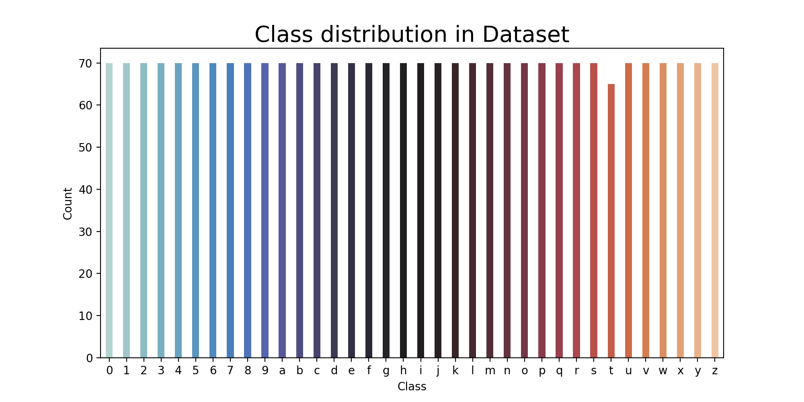
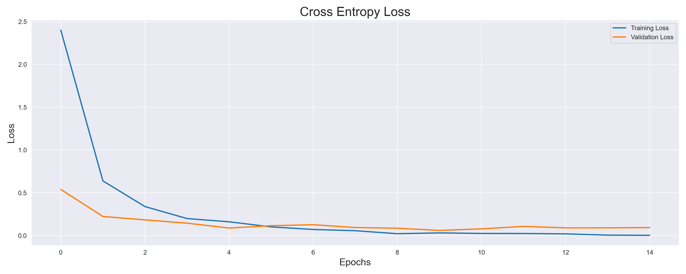
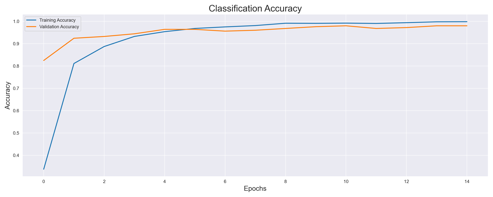
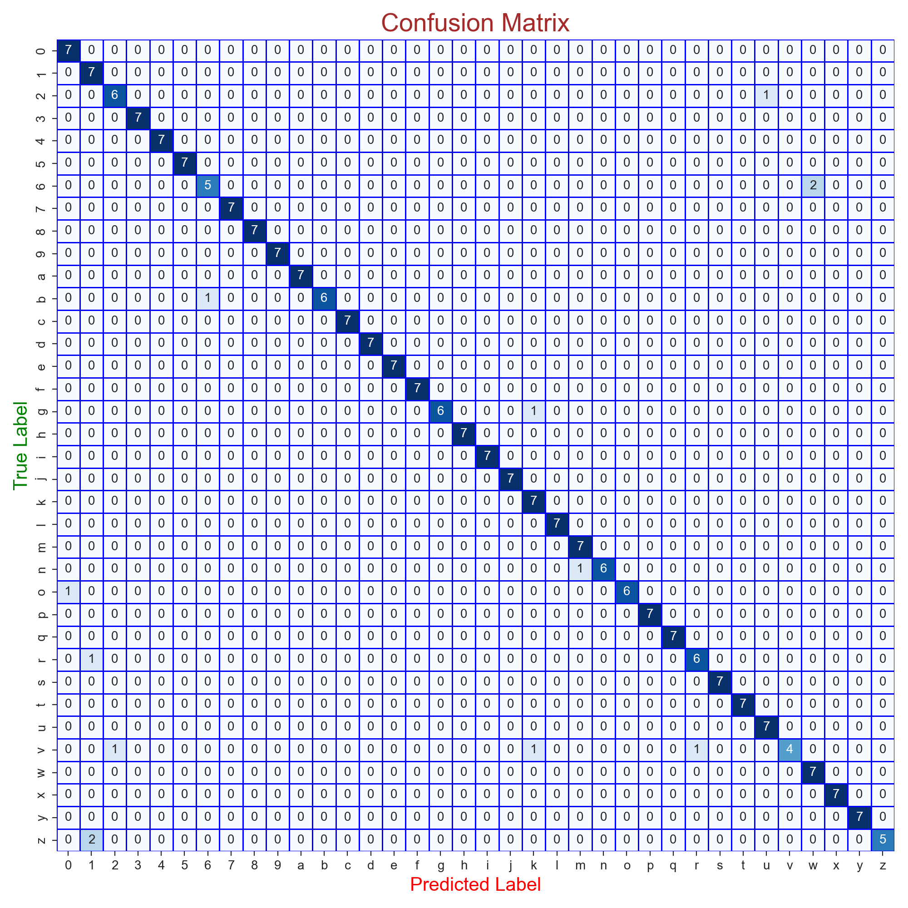

# Sign Language Classification 📷 🚀

## Introduction
Speech-impaired individuals use hand signs and gestures to communicate. However, understanding their language can be challenging for those who are not familiar with it. This project aims to develop a system that recognizes different signs and gestures, facilitating communication for both speech-impaired and normal individuals.

### Objective
The objective of this project is to develop a convolutional deep learning neural network for the classification of sign language images.

### Dataset
The dataset used in this project consists of images of various hand signs and gestures. Each image is labeled with the corresponding sign or gesture.

### Problem Type
This project addresses a multiclass classification problem.

## Table of Contents
1. [Introduction](#1)
2. [Data Description](#2)
3. [Loading Libraries](#3)
4. [Data Extraction](#4)
5. [Data Exploration](#5)
6. [Train Test Split](#6)
7. [Data Preparation](#7)
    1. [Image Data Generator](#8)
        1. [Flow from Directory](#9)
8. [Deep Learning Model](#10)
    1. [Model Layers](#11)
    2. [Callbacks](#12)
    3. [Compile Model](#13)
    4. [Fit Model](#14)
    5. [Evaluation](#15)
    6. [Plot Result](#16)
9. [Prediction](#17)
10. [Classification Report](#18)
11. [Conclusion](#19)

## Introduction

In this project, we aim to develop a Convolutional Neural Network (CNN) to classify images of American Sign Language (ASL) alphabets and numbers. The CNN model is trained on a dataset consisting of hand sign images, and its performance is evaluated on unseen test data.

## Data Description

The dataset contains a collection of images representing alphabets from the American Sign Language (ASL). It consists of 2515 images with dimensions of 400x400 pixels. The dataset is organized into 36 folders, each representing a different class (0-9, A-Z).

## Loading Libraries

The necessary libraries for data preprocessing, model development, and evaluation are imported in this section.

## Data Extraction

In this section, the images are extracted from the dataset folders, and a DataFrame is created to store filenames and corresponding categories.

## Data Exploration

Data exploration is conducted to visualize a few images from the dataset and understand the distribution of classes.

### Dataset Distribution

## Train Test Split

The dataset is split into training, validation, and test sets to train and evaluate the model.

## Data Preparation

Data preparation involves preprocessing and augmenting the image data using the ImageDataGenerator class.

## Deep Learning Model

The CNN model architecture, consisting of convolutional layers, pooling layers, dropout layers, and fully connected layers, is developed in this section.

## Evaluation

The performance of the trained model is evaluated on both the training and validation datasets.

### Training and Validation Accuracy

- Training Accuracy: 98.54%
- Validation Accuracy: 96.12%

### Training and Validation Loss

- Training Loss: 0.056
- Validation Loss: 0.112

## Plot Results

The training and validation loss, as well as the training and validation accuracy, are plotted to visualize the training progress and performance of the model.

### Cross Entropy Loss

### Classification Accuracy

## Prediction

The trained model is used to make predictions on the test data, and the accuracy of the model on the test dataset is evaluated.

## Classification Report

A classification report and confusion matrix are generated to evaluate the performance of the model on each class and analyze any misclassifications.

|           | Precision | Recall | F1-Score | Support |
|-----------|-----------|--------|----------|---------|
| 0         | 0.88      | 1.00   | 0.93     | 7       |
| 1         | 0.70      | 1.00   | 0.82     | 7       |
| 2         | 0.86      | 0.86   | 0.86     | 7       |
| 3         | 1.00      | 1.00   | 1.00     | 7       |
| 4         | 1.00      | 1.00   | 1.00     | 7       |
| 5         | 1.00      | 1.00   | 1.00     | 7       |
| 6         | 0.83      | 0.71   | 0.77     | 7       |
| 7         | 1.00      | 1.00   | 1.00     | 7       |
| 8         | 1.00      | 1.00   | 1.00     | 7       |
| 9         | 1.00      | 1.00   | 1.00     | 7       |
| a         | 1.00      | 1.00   | 1.00     | 7       |
| b         | 1.00      | 0.86   | 0.92     | 7       |
| c         | 1.00      | 1.00   | 1.00     | 7       |
| d         | 1.00      | 1.00   | 1.00     | 7       |
| e         | 1.00      | 1.00   | 1.00     | 7       |
| f         | 1.00      | 1.00   | 1.00     | 7       |
| g         | 1.00      | 0.86   | 0.92     | 7       |
| h         | 1.00      | 1.00   | 1.00     | 7       |
| i         | 1.00      | 1.00   | 1.00     | 7       |
| j         | 1.00      | 1.00   | 1.00     | 7       |
| k         | 0.78      | 1.00   | 0.88     | 7       |
| l         | 1.00      | 1.00   | 1.00     | 7       |
| m         | 0.88      | 1.00   | 0.93     | 7       |
| n         | 1.00      | 0.86   | 0.92     | 7       |
| o         | 1.00      | 0.86   | 0.92     | 7       |
| p         | 1.00      | 1.00   | 1.00     | 7       |
| q         | 1.00      | 1.00   | 1.00     | 7       |
| r         | 0.86      | 0.86   | 0.86     | 7       |
| s         | 1.00      | 1.00   | 1.00     | 7       |
| t         | 1.00      | 1.00   | 1.00     | 7       |
| u         | 0.88      | 1.00   | 0.93     | 7       |
| v         | 1.00      | 0.57   | 0.73     | 7       |
| w         | 0.78      | 1.00   | 0.88     | 7       |
| x         | 1.00      | 1.00   | 1.00     | 7       |
| y         | 1.00      | 1.00   | 1.00     | 7       |
| z         | 1.00      | 0.71   | 0.83     | 7       |

Accuracy: 0.95
Macro Avg Precision: 0.96
Macro Avg Recall: 0.95
Macro Avg F1-Score: 0.95
Weighted Avg Precision: 0.96
Weighted Avg Recall: 0.95
Weighted Avg F1-Score: 0.95

## Conclusion

In conclusion, this project demonstrates the successful development and evaluation of a CNN model for sign language classification. The model achieves high accuracy on the test dataset and shows promising results for real-world applications in assisting speech-impaired individuals.

---
